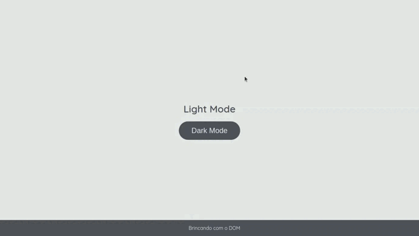

# Dark Mode and Light Mode

Atividade de fixação proposta pela [stebsnusch]( https://github.com/stebsnusch/basecamp-javascript/tree/main/DOM ) em seu curso de *javascript* pela **Dio**.

#### Resultado final:

